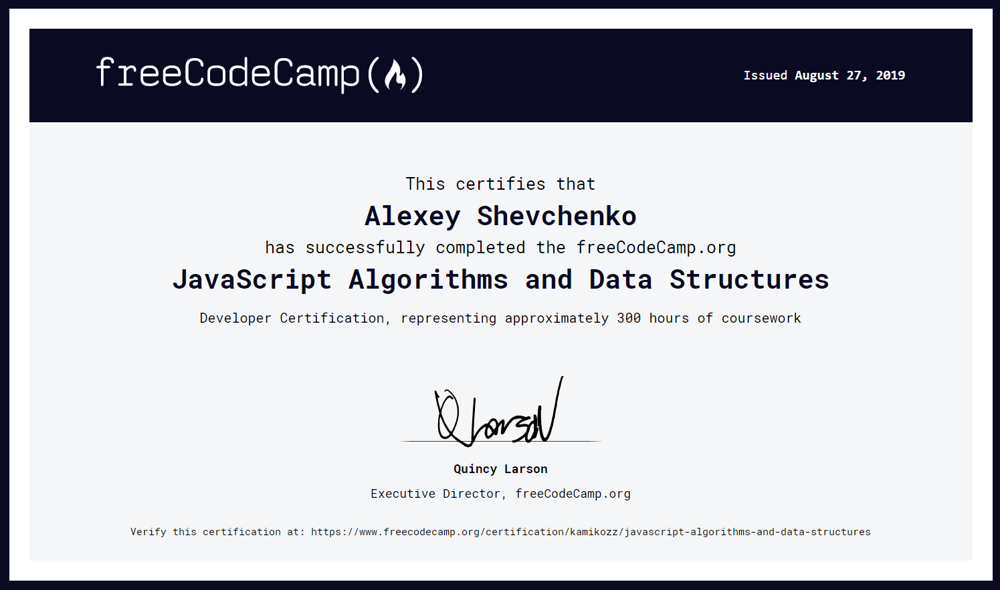

## Screenshot:

## Description:
`freeCodeCamp` is the website where you can learn, build projects and earn certifications with Frontend, Backend, Fullstack tasks.

In this part of the tasks are just `BasicJS` which consist of **JavaScript Algorithms and Data Structures** on native `JavaScript`. Furthermore will be another parts of the projects. 
## Certificate:
https://www.freecodecamp.org/certification/kamikozz/javascript-algorithms-and-data-structures
## Overall development time:
`20 August 2019` - `01 September 2019`
